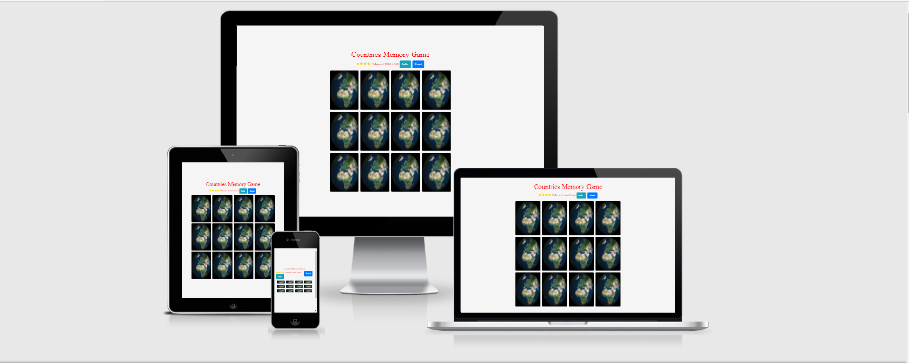

<h1 style="text-align: center">Countries Memory Game</h1>

[live site](https://tomfinnegan.github.io/Memory-game/)

This is a webiste to test you memory on countries of the world.it's desgined to be responsible and accesible on a range of devices making it easy to navigate

<h1>User Experience (UX)</h1>

>
  <h2>User Stories</h2>

   First Time visitor Goals 

   a. As a First Time Visitor i want to easily understand  how to play the game  
   b. As a First Time Visitor i want to see how i'm getting on as the game is in progress 

  <h2>Returning Visitor Goals</h2>
  
    a.As a Returning visitor i want to find get a better score than the first time 
   
  <h2>Desgin</h2>

  Color Scheme:

  The main color is white for the background the color of the text is red for the header ,moves and timer the stars are a yellow

<h2>Typography</h2>

Tangerine

the main font is Tangerine
 

 Tangerine is a calligraphy font inspired by many italic chancery hands from the 16-17th century. Its tall ascender, the most distinct characteristic of this type, takes a wide line space between lines and gives it a graceful texture. It is generally advisable to use Tangerine for a title or short text at large size because of the short height of lowercase letters. Tangerine is produced by Japanese type designer Toshi Omagari and was named after a woman who encouraged him to begin this work.

serif

serifs are the small lines or strokes at the ends of the main strokes of the letters in a particular font. Sometimes, serifs are also descriptively explained as “hooks” or “little feet” at the ends of the vertical and horizontal strokes of a letter. Consequently, fonts with serifs are usually mentioned as Serif fonts, for example, Times Roman, Garamond, Souvenir, etc. 

[link for reference of Tangerine](https://www.1001fonts.com/tangerine-font.html)

<h2>Imagery</h2>
 
 imagery is important as the main purpose of the game is card matching
  I used countries of the world for the user to try to match. this is 
  why i choose countries of the world as a memory card game 

<h1>balsamiq:</h1>

 desktop/moblie wireframe - [balsmaq wireframe](https://balsamiq.cloud/spx8hwa/pqxt7gg/r2278)

<h2>Features</h2>

responsive on all devices

interactive elements

<h2>Technology Used</h2>

<h3>Languages used</h3>

HTML 5

CSS

JAVASCRIPT

<h2>Frameworks,Libraries and programs Used</h2>

<h3>Bootstrap v 4.5.3</h3>
this is used to create a modal for information and responsive styling of the webiste

<h2>Google Fonts</h2>
